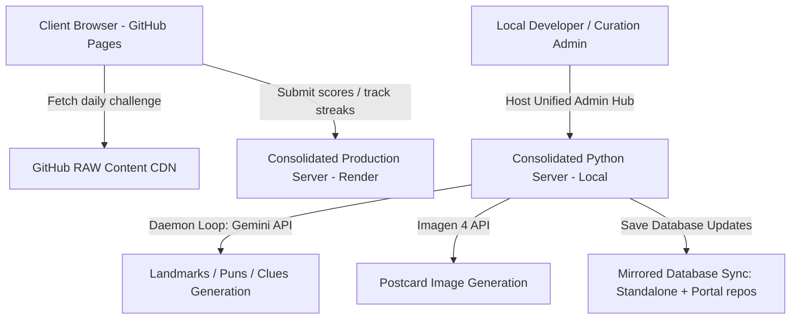

# 🗺️ PunFiction: 1-Star Travel Reviews & Curation Pipeline

Welcome to the **PunFiction** codebase. This developer manual documents the architecture, mechanics, client-side lifecycle, curation pipeline, database schemas, and developer workflows for the **1-Star Travel Reviews** daily wordplay game and its background daemon content generator.

---

## 🚀 System Architecture Overview

PunFiction is built as a highly decoupled, serverless-oriented portal coupled with a consolidated Python-based curation backend.



### 1. The Frontend Client (GitHub Pages)
- **Tech Stack:** Vanilla HTML5, CSS3 (Neobrutalist theme system), and native JavaScript (ES6+).
- **Hosting:** Hosted on GitHub Pages inside the [PunFiction main portal repository](https://github.com/iwandres/PunFiction).
- **Assets CDN:** Fetches static daily game databases (`travelreviews_daily_games.json`) directly from the GitHub Raw CDN to bypass cold starts and minimize page-load latency.
- **Analytics & Tracking:** Integrates Google Analytics (gtag) with custom events to track puzzle starts, hint reveals, solve rates, and user action metrics.

### 2. The Consolidated Curation Server & API (Render)
- **Tech Stack:** Python 3, native `http.server` implementation for minimal overhead.
- **Hosting:** Hosted as a web service on Render at `https://punfiction.onrender.com`.
- **Telemetry & DB:** Integrates with local JSON databases and custom python serialization to handle daily challenge records, user streak counts, and aggregate solve distributions.

---

## 🎮 Game Mechanics & Frontend Lifecycle

In **1-Star Travel Reviews**, players solve a daily location-based wordplay puzzle. The core mechanic requires deducing the **Real Location** from a humorous, parodied review written by a traveler who was severely confused by a pun (e.g. reviewing "Alcohol-traz Island" instead of "Alcatraz Island").

### 1. Step-by-Step Gameplay Progression
1. **The Review Clue:** The page loads the daily challenge, presenting a 1-star rating indicator, the reviewer's username, and **Clue 1** (a parodied review title and body text).
2. **Guessing Input:** The player enters their guess in a segmented, character-width input field. Correct character lengths are indicated by blank slots.
3. **Progressive Hints:** If the player is stuck, they can progressively unlock:
   - **Clue 2:** An additional, slightly more descriptive parodied traveler review.
   - **Clue 3:** A final traveler review containing subtle, clever geographical/cultural context clues (e.g., mentioning Parisian icons or local delicacies).
   - **Map/Globe Stamp (Real Location Hint):** A visual stamp showing the exact spelling and name of the **Real Location** (e.g. *Eiffel Tower*).
   - **Owner's Reply (Final Funnel Hint):** A sarcastic reply from the business owner, containing a letter-by-letter hint (e.g., *W_____ T____*).
4. **Victory Screen:** Upon solving, the game renders the aggregate Solve Distribution bar chart (visualized in a vibrant mint-to-red temperature scale) and invites the player to share their score with friends.

---

## 🛠️ The Curation Hub Pipeline

The **Consolidated Curation Server** (`unified_server.py`) hosts a step-by-step content generation engine on `http://localhost:8000`.

```
[Step 1: Landmarks] ➔ [Step 2: Puns] ➔ [Step 3: Clues] ➔ [Step 4: Postcards] ➔ [Step 5: Daily Challenge Scheduler]
```

### Curation Lifecycle Stages

#### Step 1: Landmarks
- **Source:** Seeded list of famous global travel attractions (`travelreviews_landmarks.json`).
- **Action:** Admin approves landmarks to queue them for pun generation.

#### Step 2: Puns
- **Automation:** A background daemon thread scans approved landmarks and calls the **Gemini 2.5 Flash** model to generate candidate puns (e.g. *Taj Ma-Haul*).
- **Curation:** Admin approves high-quality puns and filters out spelling or phonetic mismatches. Duplicate pending candidates automatically sweep out of view.

#### Step 3: Clues & Themes
- **Automation:** The daemon thread detects approved puns and generates three progressive traveler reviews and a sarcastic owner response.
- **Dynamic Themes:** Gemini selects the best matching visual theme (e.g. `desert_safari` for Pyramids, `gondola_ride` for Venice, `winter_lodge` for Matterhorn) from 11 responsive stylesheet templates.

#### Step 4: Postcards
- **Editable Prompts:** Admin edits the image prompt for the parodied landmark.
- **Imagen 4 Generation:** Image generation is manually triggered to conserve costs. It utilizes the `imagen-4.0-generate-001` model in `4:3` ratio, using random styling (cartoon, retro poster, watercolor, etc.).
- **Sweeper Mode:** On approval, postcards are saved, and the item is immediately swept from view to keep the pipeline clean.

#### Step 5: Daily Challenge Scheduler
- **Daily Compilation:** The approved postcards are compiled into the production challenge database (`travelreviews_daily_games.json`).
- **Release Schedule:** Anchored to **July 4, 2026**. Challenges are released daily at **2:00 AM Pacific Time**. Future challenges remain locked to players.

---

## 📁 Database Schema Reference

### 1. Landmarks (`travelreviews_landmarks.json`)
```json
{
  "id": "landmark_amalfi_coast_1783313857_963",
  "name": "Amalfi Coast",
  "country": "Italy",
  "status": "approved"
}
```

### 2. Puns (`travelreviews_puns.json`)
```json
{
  "id": "pun_amalfi_coast_1783313857_963_1783397188_544",
  "original_name": "Amalfi Coast",
  "pun_name": "San Tortellini",
  "status": "approved"
}
```

### 3. Clues (`travelreviews_clues.json`)
```json
{
  "id": "clue_pun_amalfi_coast_1783313857_963_1783397188_544_1783397204_992",
  "pun_name": "San Tortellini",
  "original_name": "Amalfi Coast",
  "review_title": "Pasta Paradise or Tourist Trap?",
  "clue1": "Expected a stunning Italian coastline, but the beaches were covered in cheese-filled pasta sheets!",
  "clue2": "The Mediterranean breeze smelled like boiling garlic and marinara sauce.",
  "clue3": "Beautiful Italian cliffs, but navigating through layers of dough pockets was exhausting.",
  "owner_response": "Dear traveler, our historic Italian coastline is renowned for its coastal beauty, not for serving as a giant pasta pot. If you want tortellini, try a local trattoria instead of our beaches.",
  "page_theme": "gondola_ride",
  "status": "approved"
}
```

### 4. Postcards (`travelreviews_postcards.json`)
```json
{
  "id": "postcard_clue_pun_amalfi_coast_1783313857_963_1783397188_544_1783397204_992_1783398102",
  "clue_id": "clue_pun_amalfi_coast_1783313857_963_1783397188_544_1783397204_992",
  "pun_name": "San Tortellini",
  "original_name": "Amalfi Coast",
  "image_prompt": "Vibrant cartoon illustration of cliffs made of giant tortellini pasta over a blue sea under the Italian sun.",
  "image_path": "/assets/cartoons/san_tortellini_1783436354.png",
  "art_style": "cartoon",
  "owner_response": "Dear traveler...",
  "page_theme": "gondola_ride",
  "status": "approved"
}
```

### 5. Daily Challenge Games (`travelreviews_daily_games.json`)
```json
{
  "puzzle_number": "038",
  "puzzle_id": "clue_pun_amalfi_coast_1783313857_963...",
  "boss_id": "boss_clue_pun_amalfi_coast_1783313857_963...",
  "boss_original_title": "Amalfi Coast",
  "boss_pun_title": "San Tortellini",
  "answer": "_____ _____",
  "boss_hint2": "A_____ C____",
  "reviewer_name": "Anonymous",
  "review_title": "Pasta Paradise or Tourist Trap?",
  "clue1": "Expected a stunning Italian coastline, but...",
  "clue2": "The Mediterranean breeze smelled like...",
  "clue3": "Beautiful Italian cliffs, but...",
  "boss_pitch": "Dear traveler...",
  "boss_poster_url": "/assets/cartoons/san_tortellini_1783436354.png",
  "difficulty_tier": 1,
  "status": "approved",
  "page_theme": "gondola_ride",
  "puzzles": []
}
```

---

## 🔄 Repository Mirroring & Sync Workflows

Because the game client is served from the consolidated portal repository (`PunFiction-BoxOffice`) while content development occurs in the standalone repository (`PunFiction-TravelReviews`), all writes are mirrored:

### 1. Automated Code Mirroring
When saving changes in the curation panel or generating postcard images, the server automatically mirrors operations:
- **JSON Databases:** Saves are written to both `PunFiction-TravelReviews/backend/` and `PunFiction-BoxOffice/backend/`.
- **Postcard Images:** Generated PNGs are saved to both `PunFiction-TravelReviews/travelreviews/assets/cartoons/` and `PunFiction-BoxOffice/travelreviews/assets/cartoons/`.
- **Cascading Deletions:** Rejected item deletions mirror across both workspaces instantly.

### 2. Manual Git Syncing & Deployment
To make curation changes live on the public website:
1. Access the local Git terminal in `PunFiction-BoxOffice`.
2. Stage and commit the synced databases and assets:
   ```bash
   git add -A
   git commit -m "Sync daily games database and new postcard cartoon assets"
   git push origin main
   ```
3. The site will deploy automatically via GitHub Pages at:
   `https://iwandres.github.io/PunFiction/travelreviews/`
